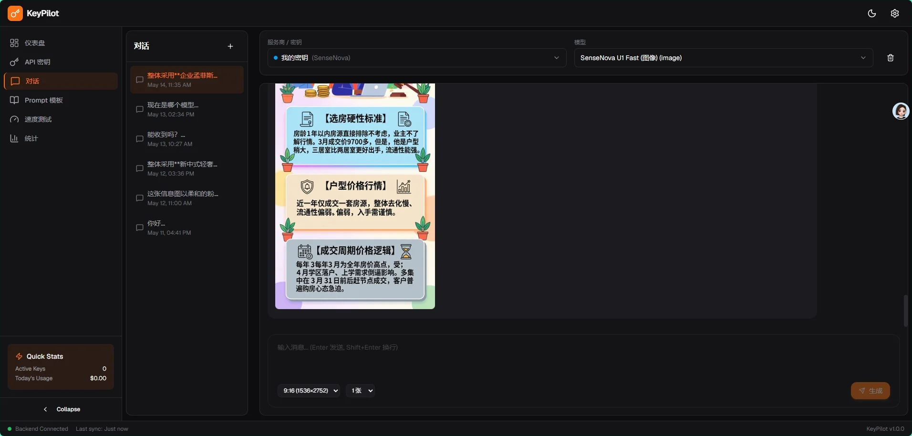

# KeyPilot

开源、轻量、本地部署、私化自用的多厂商 AI Key/Token 聚合管理平台。



## Features

- **多厂商 Key 管理** - 支持 OpenAI、Anthropic、Google AI、MiniMax、SenseNova、DeepSeek、自定义 provider
- **统一对话界面** - 跨模型切换，Markdown 代码高亮，流式输出
- **密钥测速** - 测试各 Key 延迟和吞吐量
- **额度统计** - 用量可视化，按供应商分类
- **多模型生成** - 图片、视频、音频、音乐生成（MiniMax、SenseNova）
- **本地优先** - SQLite 数据库存储，不上传任何数据
- **主题切换** - 支持暗黑/浅色/跟随系统

## Tech Stack

**Frontend:**
- React 18 + TypeScript + Vite
- TailwindCSS + shadcn/ui
- Zustand (状态管理)
- Axios + React Router v6

**Backend:**
- Node.js + Express + TypeScript
- SQLite 数据库本地存储（sql.js）
- CORS 启用（纯本地）

## Quick Start

### 1. 启动后端

```bash
cd backend
pnpm install
pnpm run dev
```

后端运行在 `http://localhost:3001`

### 2. 启动前端

```bash
cd frontend
pnpm install
pnpm run dev
```

前端运行在 `http://localhost:5173`

### 3. 打开浏览器

访问 `http://localhost:5173` 开始使用。

## Project Structure

```
KeyPilot/
├── frontend/                 # React 前端
│   ├── src/
│   │   ├── components/      # UI 组件
│   │   │   ├── ui/         # shadcn/ui 基础组件
│   │   │   └── layout/     # 布局组件
│   │   ├── pages/          # 页面组件
│   │   ├── stores/         # Zustand 状态管理
│   │   └── lib/            # 工具函数
│   └── public/
├── backend/                  # Node.js 后端
│   ├── src/
│   │   ├── routes/         # API 路由
│   │   └── dataStore.ts    # SQLite 数据存储
│   └── data/               # SQLite 数据库文件
└── SPEC.md                  # 详细设计规格
```

## API Endpoints

| Method | Endpoint | Description |
|--------|----------|-------------|
| GET | `/api/keys` | 获取所有 Key |
| POST | `/api/keys` | 添加新 Key |
| PUT | `/api/keys/:id` | 更新 Key |
| DELETE | `/api/keys/:id` | 删除 Key |
| POST | `/api/keys/:id/test` | 测试单个 Key |
| POST | `/api/keys/test-all` | 测试所有 Key |
| POST | `/api/chat` | 发送对话消息 |
| GET | `/api/chat/history` | 获取对话历史 |
| POST | `/api/images/generate` | 生成图片 |
| GET | `/api/images/history` | 获取图片历史 |
| GET | `/api/usage` | 获取用量统计 |
| GET/POST | `/api/settings` | 获取/更新设置 |

## Data Storage

所有数据存储在 `backend/data/` 目录下的 SQLite 数据库中：

- `keypilot.db` - SQLite 数据库文件（包含 keys、conversations、usage 等表）

## Privacy

- 所有数据存储在本地，不会上传到任何服务器
- API Keys 和聊天记录存储在本地 SQLite 数据库
- 后端不收集任何使用统计或遥测数据
- **注意**：`keypilot.db` 和 `keys.json` 不会被提交到 git

## License

MIT
